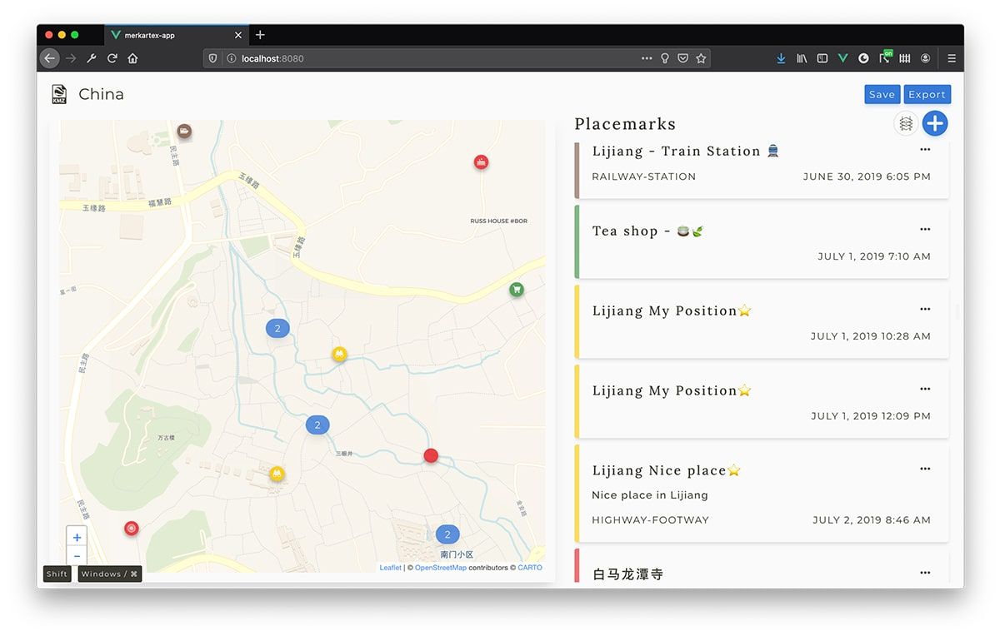
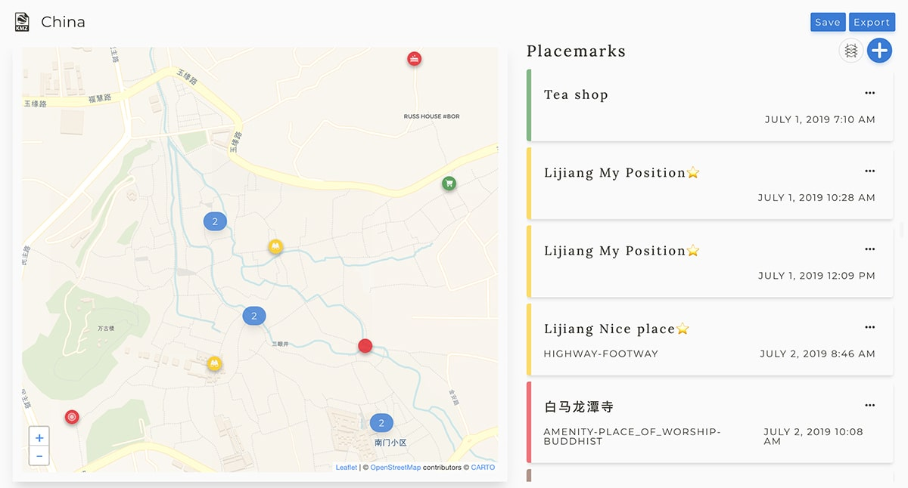
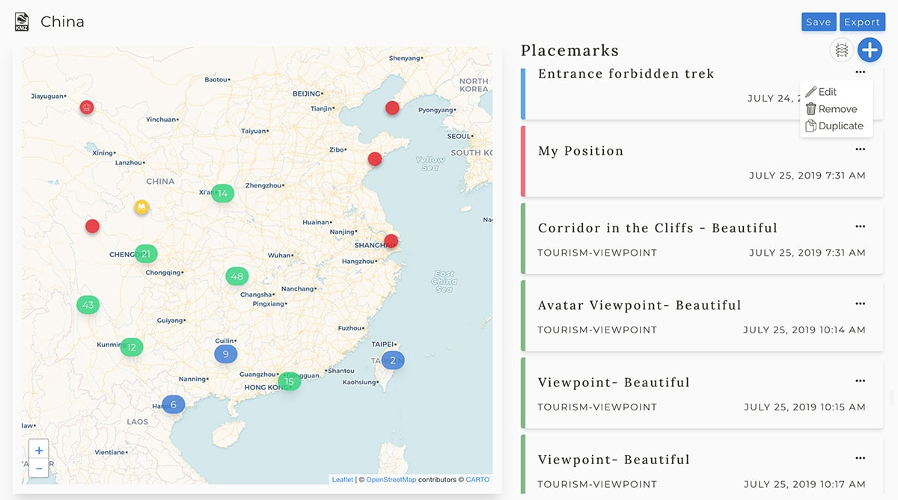
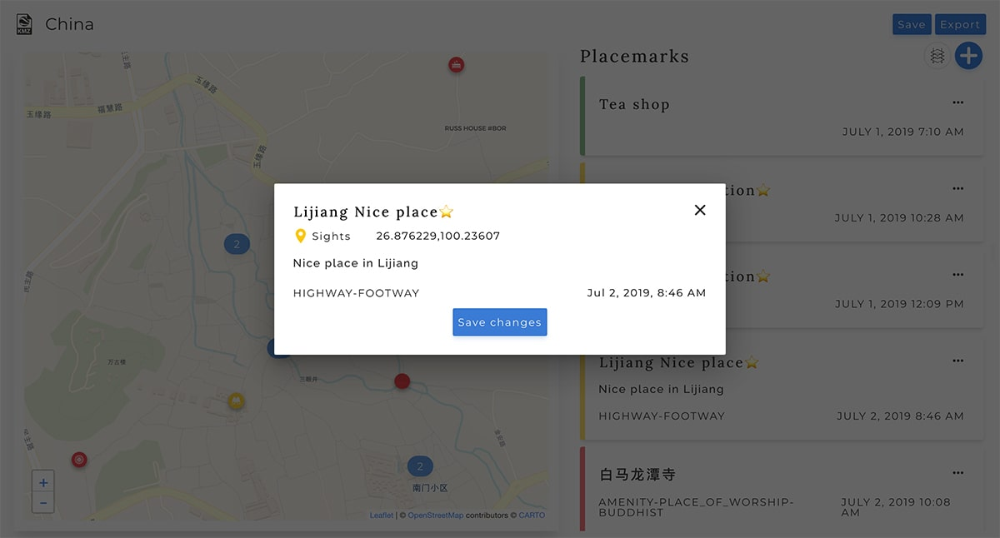
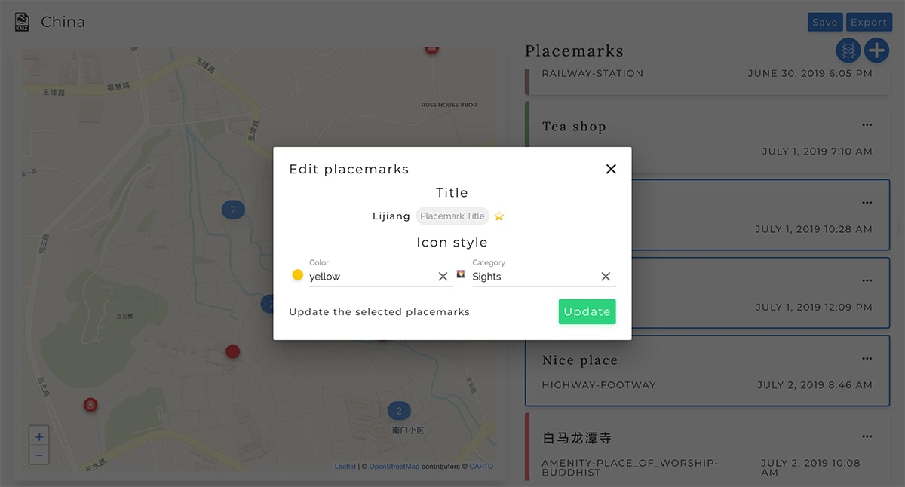
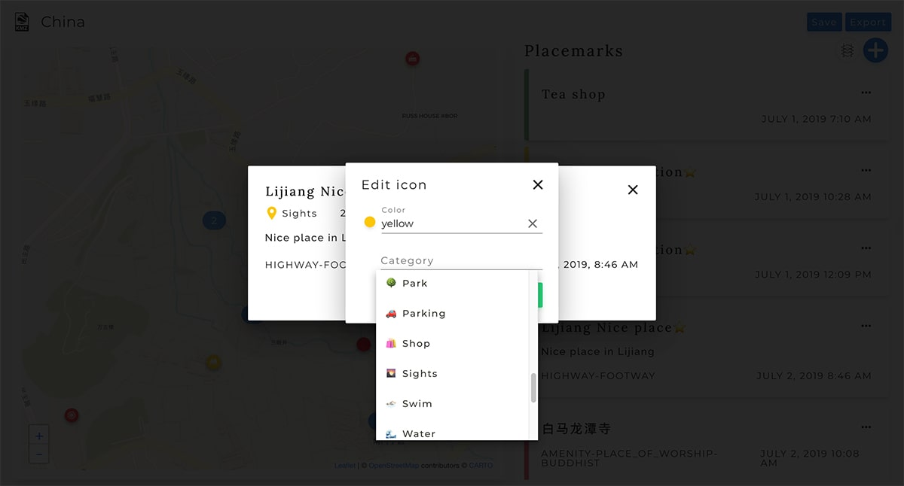
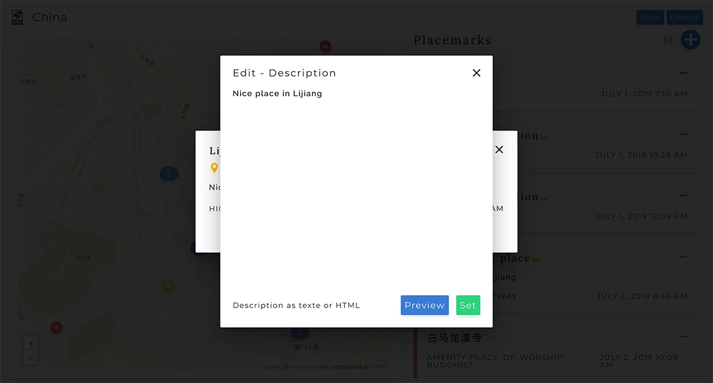

# Merkartex - Edit MapsMe maps
For my needs, I have designed and created a web application to quickly edit KMZ maps for MapsMe from Google Maps and MapsMe maps. You can edit multi placemarks at the same time, edit parameters such as icon categories (impossible to do in MapsMe), properly import Google Maps map in MapsMe, handle HTML descriptions...

## Interface Merkartex Application

### Edit placemark

### Edit multiple placemarks

### Edit placemark icon

### Edit placemark description

